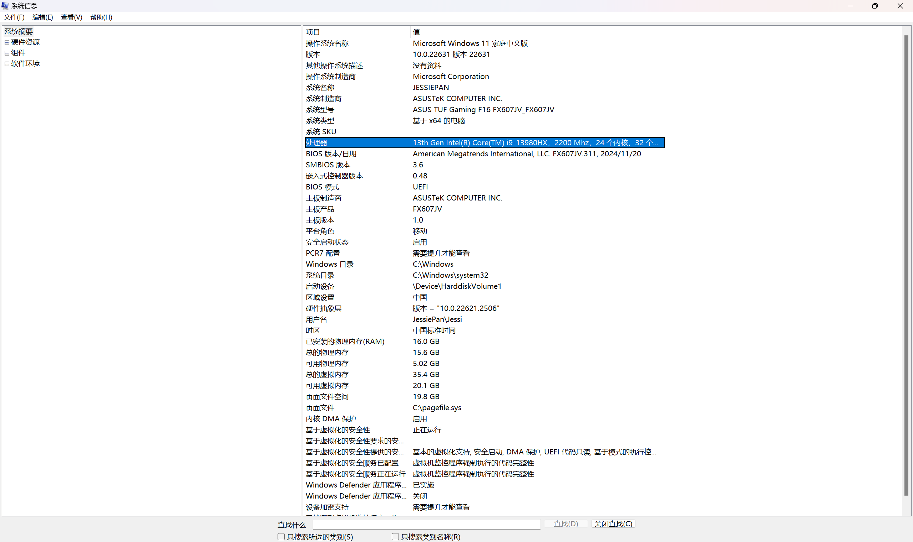

# 操作系统： microsoft windows 11家庭中文版

# 系统制造商： ASUSTek COMPUTER INC.

# 系统型号： ASUS TUF Gaming F16 FX607JV_FX607JV
## TUF(the ultimate force) 
## 16 inches

# 系统类型： x86
## x86 == x86_32 == 32位 （SysWOW64 = system Windows 32-bit on Windows 54-bit）
## x64 == x86_64 == 64位 （System32
